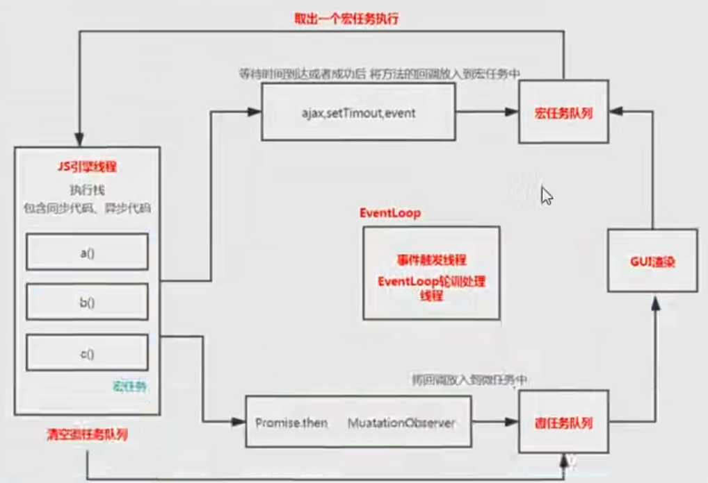

### 浏览器事件循环

事件循环主要是为了实现 js 的异步概念

js 是单线程的

进程：计算机分配任务的最小单位
进程中包含多个进程

**浏览器的进程**

- 每一个页面都是进程（互不影响）
- 浏览器也有一个主进程（用户界面）
- 渲染进程每个页面里都有一个渲染进程（浏览器内核）
  - GUI 渲染线程（用于渲染页面）
  - js 引擎线程 他和页面渲染时互斥
  - 事件触发线程 独立的线程 EventLoop
  - 事件 click setTimeout ajax 也是一个独立线程
- 网络进程（处理请求）
- GPU 进程 3d 绘制
- 第三方插件的进程

**EventLoop 整体流程图**

**执行步骤：**

1. js 执行的时候，从上到下，遇到函数会创建执行上下文放入到执行栈中，执行完毕后会出栈，可能会发生异步事件 内部会调用浏览器 Api
2. 当我们执行上下文栈都执行完毕后，等会可能 api 执行完成或者时间到达，维护一个事件"队列" 先进先出
3. 不停的扫描队列，将队列中的任务拿出来放到上下文执行栈中执行，事件循环线程就是做这件事情的，检查当前执行栈是否为空，如果为空，从事件队列中取出一个来执行
4. 当代码执行时还会有一些任务 promise 为例，微任务，每次执行宏任务的时候，都会单独创建一个微任务 队列 先进先出
5. 微任务执行完毕后，浏览器会检查是否需要重新渲染，浏览器有刷新频率（16.6ms）
6. 每次循环一次，都会执行一个宏任务并清空对应的微任务队列，每次循环完毕后，都要看看是否要渲染，如果需要渲染才渲染
7. 如果微任务在执行过程中再次生成微任务，会在本轮直接清空

**常见宏任务**

- script 脚本
- 界面渲染
- setTimeout
- setInterval
- poseMessage
- MessageChannel
- setImmediate

**常见微任务**

- promise.then
- mutationObserver
- 事件
- ajax
